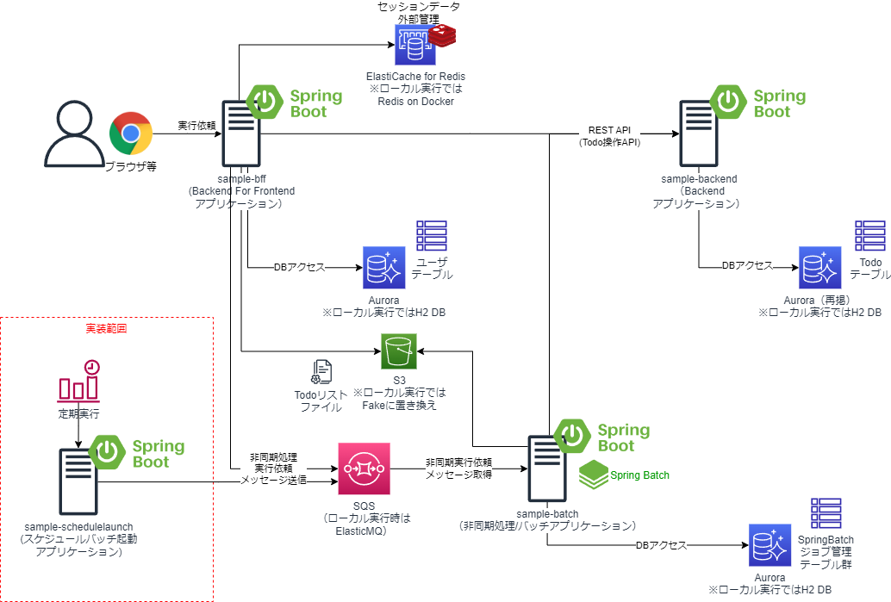

# SpringBootのスケジュールバッチ起動用アプリケーションサンプル

## 概要
* Spring BootでSpring JMS + AWS SQS Messaging Libraryを使って、SQSを介在したメッセージング処理方式で、スケジュールトリガでジョブ起動するためのサンプルAPである。
* 開発端末ローカル実行時にAWS SQSがなくても動作するよう、バッチAP側でSQS互換のFakeしてElasticMQを組み込みで起動して動作するため、特にAWS環境がなくても単独実行可能である。


## プロジェクト構成
* sample-bff
    * 別のプロジェクト。当該名称のリポジトリを参照のこと。Spring BootのWebブラウザアプリケーション（Backend for Frontend）で、ユーザがログイン後、TODOやユーザを管理する画面を提供する。また、画面やAPIからsample-batchへの非同期実行依頼も可能である。
        * デフォルトでは「spring.profiles.active」プロパティが「dev」になっている。プロファイルdevの場合は、RDB永続化にはH2DBによる組み込みDB、セッション外部化は無効化、SQS接続はsample-batch側で組み込みで起動するElasticMQへ送信するようになっている。
        * プロファイルproductionの場合は、RDB永続化にはPostgreSQL(AWS上はAurora等）、セッション外部化はRedis(ローカル時はRedis on Docker、AWS上はElastiCache for Redis)、SQS接続はSQSへ送信するようになっている。
* sample-backend（またはsample-backend-dynamodb)
    * 別プロジェクト。当該名称のリポジトリを参照のこと。Spring BootのREST APIアプリケーションで、sample-webやsample-batchが送信したREST APIのメッセージを受信し処理することが可能である。
        * sample-backendは永続化にRDBを使っているが、sample-backend-dynamodbは同じAPのDynamoDB版になっている。
        * デフォルトでは「spring.profiles.active」プロパティが「dev」になっている。プロファイルdevの場合は、RDB永続化にはH2DBによる組み込みDBになっている。また、sample-backend-dynamodbプロジェクトの場合は、AP起動時にDynamoDBの代わりに、DynamoDB Localを組み込みで起動し、接続するようになっている。
        * プロファイルproductionの場合は、RDB永続化にはPostgreSQL(AWS上はAurora等）になっている。また、sample-backend-dynamodbプロジェクトの場合は、DynamoDBに接続するようになっている。
* sample-batch
    * 別プロジェクト。当該名称のリポジトリを参照のこと。Spring JMSを使ったSpring Bootの非同期処理アプリケーションで、sample-webやsample-schedulelaunchが送信した非同期実行依頼のメッセージをSQSを介して受信し処理することが可能である。    
        * デフォルトでは「spring.profiles.active」プロパティが「dev」になっている。プロファイルdevの場合は、AP起動時にSQSの代わりにElasticMQを組み込みで起動し、リッスンするようになっている。また、RDB永続化にはH2DBによる組み込みDBになっている。
        * プロファイルproductionの場合は、SQSをリッスンするようになっている。また、RDB永続化にはPostgreSQL(AWS上はAurora等）になっている。
* sample-schedulelaunch
    * 本プロジェクト。SpringBootのCLIアプリケーションで、実行時に引数または環境変数で指定したスケジュール起動バッチ定義IDに対応するジョブの非同期実行依頼を実施し、SQSを介して、sample-batchアプリケーションのジョブを実行する。スケジュールによるバッチ起動を想定したアプリケーション。
        * デフォルトでは「spring.profiles.active」プロパティが「dev」になっている。プロファイルdevの場合は、SQS接続はsample-batch側で組み込みで起動するElasticMQへ送信するようになっている。
        * プロファイルproductionの場合は、SQS接続はSQSへ送信するようになっている。
## 事前準備
* 以下のライブラリを用いているので、EclipseのようなIDEを利用する場合には、プラグインのインストールが必要
    * [Lombok](https://projectlombok.org/)
        * [Eclipseへのプラグインインストール](https://projectlombok.org/setup/eclipse)
        * [IntelliJへのプラグインインストール](https://projectlombok.org/setup/intellij)
    * [Mapstruct](https://mapstruct.org/)
        * [EclipseやIntelliJへのプラグインインストール](https://mapstruct.org/documentation/ide-support/)

## 動作手順
1. Backend AP（sample-backend）の起動
    * sample-backendをSpringBoot Applicationとして起動。

1. Web AP（sample-bff）の起動
    * sample-bffをSpringBoot Applicationとして起動。

1. 非同期AP（sample-batch）の起動
    * sample-batchをSpringBoot Applicationとして起動。

1. 動作確認
    * ジョブのスケジュールバッチ起動を想定し、sample-schedulelaunchを、スケジュール起動バッチ定義IDを指定してSpringBootアプリケーションを起動する。
        * 起動引数に、-Dbatch.schedule.target-id=SB_001（またはSB_002）を指定する。
    * sample-batch側がジョブjob001（またはjob002）が動作する。
        * sample-batchのAPが、SQS(ElastiqMQ)を介してsample-webから受け取ったメッセージ（スケジュール起動バッチ定義に記載したJob IDとparam01、param02の値）を処理する。        
        * TODOリストが書かれたファイル(files/input/todolist.csv)を読み込み、リストに対して一件ずつsample-backendのREST APIを呼び出し、TODOリストを一括登録する。
            * job001は、タスクレットモデルで実装している。
            * job002は、チャンクモデルでjob001と同じ処理を実装している。    

## SQSの設定
* Profileが「dev」でSpringBootアプリケーションを実行する場合、「sample-batch」アプリケーション側で、ElasitqMQが起動し、「SampleQueue」という名前のキューを作成し、それを使ってメッセージ送信するので、何もしなくてよい。
* Profileが「production」に切り替えてSpringBootアプリケーションを実行する場合、事前にAWS上にSQSのバケットを作成する必要がある。
    * 「production」に切り替えるには、例えばJVM引数を「-Dspring.profiles.active=production」に変更するか、環境変数「SPRING_PROFILES_ACTIVE=production」を設定する等して、sample-bff、sample-batchの両方のプロジェクトのプロファイルを「production」に変えて実行する。
    * 「SampleQueue」という名前のキューを作成すればよいが、キュー名を変更したい場合はapplication-production.ymlの「delayed.batch.queues.sample-batch」プロパティを作成したキュー名に変更する。
        * 「sample-batch」アプリケーション側も変更が必要

## Dockerでのアプリ起動
* Mavenビルド
```sh
#Windows
.\mvnw.cmd package
#Linux/Mac
./mvnw package
```
* ローカルでDockerビルド
```sh
docker build -t XXXXXXXXXXXX.dkr.ecr.ap-northeast-1.amazonaws.com/sample-schedulelaunch:latest .
```

* ローカルでDocker実行（Profileを「dev」でSpringBoot実行）
```sh
docker run --name sampleschedulelaunch --env SPRING_PROFILES_ACTIVE=dev,log_default XXXXXXXXXXXX.dkr.ecr.ap-northeast-1.amazonaws.com/sample-schedulelaunch:latest

#logをjson形式に変更する場合
docker run --name sampleschedulelaunch --env SPRING_PROFILES_ACTIVE=dev,log_container XXXXXXXXXXXX.dkr.ecr.ap-northeast-1.amazonaws.com/sample-schedulelaunch:latest
```

* ローカルでDocker実行（Profileを「production」でSpringBoot実行）　
    * ※AWS上のSQS作成も必要
```sh
docker run -v %USERPROFILE%\.aws\:/home/app/.aws/ --name sampleschedulelaunch --env SPRING_PROFILES_ACTIVE=production,log_default XXXXXXXXXXXX.dkr.ecr.ap-northeast-1.amazonaws.com/sample-schedulelaunch:latest

#logをjson形式に変更する場合
docker run -d -p 8080:8080 -v %USERPROFILE%\.aws\:/home/app/.aws/ --name sampleschedulelaunch --env SPRING_PROFILES_ACTIVE=production,log_container XXXXXXXXXXXX.dkr.ecr.ap-northeast-1.amazonaws.com/sample-schedulelaunch:latest
```

* ECRプッシュ
```sh
aws ecr get-login-password --region ap-northeast-1 | docker login --username AWS --password-stdin XXXXXXXXXXXX.dkr.ecr.ap-northeast-1.amazonaws.com
docker push XXXXXXXXXXXX.dkr.ecr.ap-northeast-1.amazonaws.com/sample-schedulelaunch:latest
```

## ソフトウェアフレームワーク
* 本サンプルアプリケーションでは、ソフトウェアフレームワーク実装例も同梱している。簡単のため、アプリケーションと同じプロジェクトでソース管理している。
* ソースコードはcom.example.fwパッケージ配下に格納されている。    
    * 本格的な開発を実施する場合には、業務アプリケーションと別のGitリポジトリとして管理し、CodeArtifactやSonatype NEXUSといったライブラリリポジトリサーバでjarを管理し、pom.xmlから参照するようにすべきであるし、テストやCI/CD等もちゃんとすべきであるが、ここでは、あえて同じプロジェクトに格納してノウハウを簡単に参考にしてもらいやすいようにしている。
* 各機能と実現方式は、以下の通り。

| 分類 | 機能 | 機能概要と実現方式 | 拡張実装 | 拡張実装の格納パッケージ |
| ---- | ---- | ---- | ---- | ---- |
| オン・バッチ共通 | 非同期実行依頼 | Spring JMS、Amazon SQS Java Messaging Libraryを利用し、SQSの標準キューを介した非同期実行依頼のメッセージを送信する。 | ○ | com.example.fw.common.async |
| | スケジュールバッチ起動 | application.ymlに定義した独自のスケジュールバッチ定義を読み込みバッチAPへ非同期実行依頼を実施するSpringBootのCLIアプリケーションを提供する。 | ○ | com.example.fw.common.schedule |
| | システム日時取得 | システム日時を取得するAPIを提供する。テスト時を考慮し、固定のシステム日時を外部から設定できる。 | ○ | com.example.fw.common.systemdate |
| | メッセージ管理 | MessageResourceで画面やログに出力するメッセージを管理する。 | ○ | com.example.fw.common.message |
| | 例外 | RuntimeExceptionを継承し、エラーコード（メッセージID）やメッセージを管理可能な共通的なビジネス例外、システム例外を提供する。 | ○ | com.example.fw.common.exception |
| | ロギング | Slf4jとLogback、SpringBootのLogback拡張、ver3.4からのStructured Logs機能を利用し、プロファイルによって動作環境に応じたログレベルや出力先（ファイルや標準出力）、出力形式（タブ区切りやJSON）に切替可能とする。またメッセージIDをもとにログ出力可能な汎用的なAPIを提供する。 | ○ | com.example.fw.common.logging |
| | プロパティ管理 | SpringBootのプロパティ管理を使用して、APから環境依存のパラメータを切り出し、プロファイルによって動作環境に応じたパラメータ値に置き換え可能とする。 | - | - |
| | プロパティ管理（SSM、Secrets Manager） | Spring Cloud for AWSの機能により、AWSのSSMパラメータストアやSecrets Managerに切り出したAPから環境依存のパラメータを、プロファイルによって動作環境に応じたパラメータ値に置き換え可能とする。 | - | - |
| | DI | Springを利用し、DI（依存性の注入）機能を提供する。 | - | - |
| | ボイラープレートコード排除 | Lombokを利用し、オブジェクトのコンストラクタやGetter/Setter等のソースコードを自動生成し、ボイラープレートコードを排除する。 | - | - |

* 以下は、今後追加適用を検討中。

| 分類 | 機能 | 機能概要と実現方式 | 拡張実装 | 拡張実装の格納パッケージ |
| ---- | ---- | ---- | ---- | ---- |
| オン・バッチ共通 | メトリックス転送（CloudWatch） | Spring Cloud for AWSの機能により、JVM等、Spring Boot Actuatorが提供するメトリックスをCloudWatchメトリックスへ転送する | - | - |